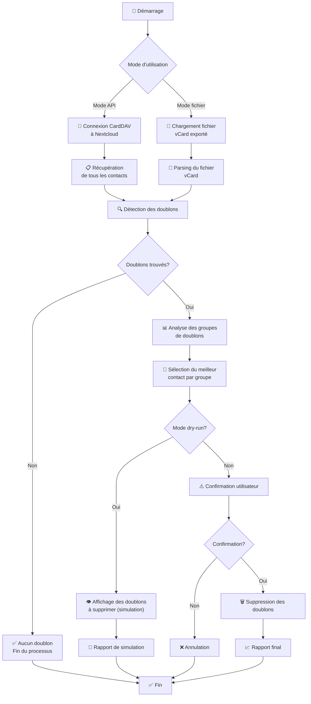

# Diagramme de fonctionnement - Nextcloud Contact Duplicate Remover

Ce diagramme illustre le workflow complet du script de suppression des contacts en doublon.

## Diagramme de flux

## Description des étapes

### 1. **Démarrage** 🚀
- Lancement du script avec les paramètres choisis
- Vérification des dépendances

### 2. **Mode d'utilisation** 
Le script propose deux modes :

#### **Mode API** 📡
- Connexion directe à Nextcloud via CardDAV
- Authentification sécurisée
- Accès temps réel aux contacts

#### **Mode fichier** 📁
- Traitement d'un fichier vCard exporté
- Méthode plus simple mais nécessite export/import manuel

### 3. **Récupération des contacts** 📋
- **Mode API** : Téléchargement via l'API CardDAV
- **Mode fichier** : Parsing du fichier vCard local
- Extraction des informations (nom, email, téléphone)

### 4. **Détection des doublons** 🔍
Critères de détection :
- Email identique (exact)
- Téléphone identique (normalisé)
- Nom similaire (algorithme de proximité)
- Combinaisons multiples

### 5. **Analyse des groupes** 📊
- Regroupement des contacts similaires
- Formation de groupes de doublons
- Statistiques de duplication

### 6. **Sélection du meilleur contact** 🎯
Critères de sélection :
- Nombre d'informations disponibles
- Richesse du contenu vCard
- Présence de champs importants (organisation, adresse, etc.)

### 7. **Mode de traitement**
#### **Dry-run** 👁️ (Par défaut)
- Simulation des suppressions
- Affichage détaillé des actions prévues
- Aucune modification réelle

#### **Suppression réelle** 🗑️
- Demande de confirmation utilisateur
- Suppression effective des doublons
- Préservation du meilleur contact par groupe

### 8. **Rapport final** 📈
- Nombre de doublons trouvés
- Nombre de contacts supprimés
- Résumé des opérations effectuées

## Codes de sortie

- **0** : Succès, opération terminée
- **1** : Erreur ou annulation utilisateur  
- **2** : Erreur critique (connexion, dépendances)

## Sécurité

- ✅ Mode dry-run par défaut
- ✅ Confirmation explicite avant suppression
- ✅ Logging détaillé de toutes les opérations
- ✅ Choix intelligent du contact à conserver
- ✅ Gestion des erreurs et rollback

## Performance

- 📊 Traitement par lots
- 🔄 Gestion de la reconnexion automatique
- ⏱️ Timeout configurables
- 💾 Optimisation mémoire pour gros volumes
